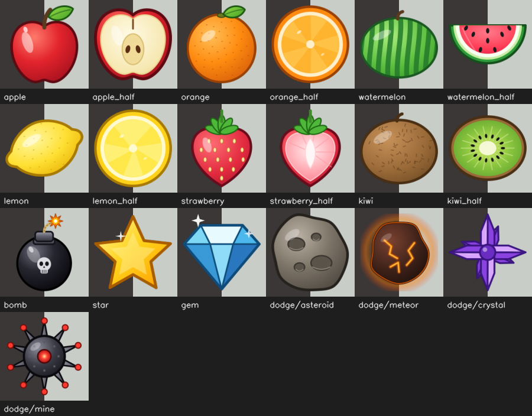

# HandArcade 🖐️🎮


Four webcam mini-games you play with your bare hands. No controller, no
mouse: your camera tracks your hand and you slice fruit, dodge obstacles,
catch falling objects and pop bubbles, all in a fullscreen arcade with music,
sound effects and saved high scores.

Built in Python with OpenCV, MediaPipe and pygame.

## Contents

- [Games](#games)
- [Quick start](#quick-start)
- [Controls](#controls)
- [Tips for good tracking](#tips-for-good-tracking)
- [Assets](#assets)
- [Art](#art)
- [Where your data is saved](#where-your-data-is-saved)
- [Project structure](#project-structure)
- [Tuning and difficulty](#tuning-and-difficulty)
- [Adding a game](#adding-a-game)
- [Building a standalone app](#building-a-standalone-app)
- [Troubleshooting](#troubleshooting)
- [Development](#development)

## Games

### 🍉 Fruit Slice
Swipe your **index fingertip** through flying fruit: apples, oranges, watermelons,
lemons, strawberries and kiwis, each splitting into two cut halves. Slice two or
more in one swipe for a combo bonus. Don't touch the bombs.

Choose **Easy**, **Medium** or **Hard** before each run. On Easy only bombs
cost a life; on Medium and Hard, fruit you miss cost a life too. Fruit come in
bursts that get faster and more frequent the longer you survive.

### 🟢 Dodge
Your **palm** controls a little creature on screen. Asteroids, meteors and
crystals fly in from every edge, and spiky **mines** hunt you.

- Moving your hand **closer to or farther from the camera** changes your depth.
- **Solid** obstacles are at your depth and can hurt you. **Faded** ones are at a
  different depth and pass through you safely.
- A red ring around a mine means it is still chasing you. Mines give up after a
  few seconds.
- On Medium and Hard, swarms are announced a moment before they arrive.

The game waits for your hand before it starts and pauses if tracking loses it.

### 🐾 Catch
Swat falling apples, stars and gems (the most valuable) with your **open palm**. Both hands work, and a
fast swipe catches everything along its path. Bombs cost you a miss, and so
does letting fruit hit the floor. Five misses ends the run, but **ten catches in
a row heal one miss**.

### 🫧 Pinch Pop
You have 60 seconds. **Pinch your thumb and index finger together** on a bubble
to pop it. Both hands work.

| Bubble | Effect |
| --- | --- |
| Normal | +10 |
| Fast | +20, smaller and quicker |
| Golden | +60 |
| Chain | +25 and pops every non-bomb bubble nearby |
| Shield | +15 and blocks the next bomb you pop |
| Bomb | -15 and resets your combo |

Pops within 1.2 seconds of each other build a combo multiplier (up to x5).
Every so often a **Bubble Frenzy** starts: more bubbles and double score.
The round gets harder as it goes: bubbles speed up and bombs get more common.

Every game remembers your best score (per difficulty where there is one).

## Quick start

You need a **webcam** and **Python 3.10 or newer**. HandArcade is developed and
tested on Windows with Python 3.11.

```bash
git clone <repo-url>
cd handarcade

python -m venv venv
venv\Scripts\activate            # macOS / Linux: source venv/bin/activate

pip install -r requirements.txt
python download_models.py        # downloads the MediaPipe hand model (once)
python generate_placeholder_sounds.py   # optional: creates simple sound effects
python main.py
```

Press **1-4** (or click a card) on the menu to start a game.

## Controls

**Menu**

| Input | Action |
| --- | --- |
| `1`-`4` or click a card | Start a game |
| `q` | Quit |
| `m` or click "Sound ON" | Mute / unmute |
| `-` / `=` | Music volume down / up |
| `[` / `]` | Sound-effect volume down / up |
| Drag the sliders | Set music / effects volume |

**In every game**

| Key | Action |
| --- | --- |
| `ESC` | Back to the menu |
| `q` | Quit |
| `SPACE` (or `r`) | Play again after a game over |

**Game specific**

| Key | Game | Action |
| --- | --- | --- |
| `1` `2` `3` | Fruit Slice, Dodge | Pick Easy / Medium / Hard |
| `d` | Fruit Slice, Dodge | Change difficulty after a game over |
| `f` | Fruit Slice | Show / hide the FPS counter |

## Tips for good tracking

- Use **good, even lighting** and a plain background if you can.
- Keep your hand **about an arm's length** from the camera and fully in frame.
- For Pinch Pop, face your palm toward the camera so the thumb and index
  finger are clearly visible.
- Close apps that use the camera (video calls, other tools); only one program
  can open it at a time.

## Assets

Everything lives in `assets/`. All of it is optional: missing files are
reported in the console and the games keep running.

| Path | What it is |
| --- | --- |
| `assets/sounds/pop.wav`, `slice.wav`, `hit.wav`, `shield.wav` | Sound effects. `python generate_placeholder_sounds.py` creates simple placeholders and never overwrites files you already have (`--force` does). |
| `assets/music/arcade_theme.ogg` / `.mp3` / `.wav` | Menu music, played in a loop. Not included. Add your own, ideally a royalty-free loop; `.ogg` loops most smoothly. |
| `assets/*.png` | Fruit Slice and Catch sprites: six fruits with cut halves (`apple.png`, `apple_half.png`, ...), `bomb.png`, `star.png`, `gem.png`, plus the hand-drawn `baste.png` / `baz.png`. Missing sprites are drawn as colored circles. |
| `assets/dodge/*.png` | Dodge obstacles: `asteroid`, `meteor`, `crystal`, `mine`. Missing sprites are drawn as plain shapes. |

The generated sprites are original art made by `tools/build_art.py` (see [Art](#art)).
If you add music or art that needs attribution, credit it in this README.

## Art

All sprites are vector art drawn in code and rendered to transparent PNGs, so
you can restyle everything in one place.



- Edit a sprite's function in `tools/build_art.py` (colors, shapes), then run
  `python tools/build_art.py` (needs `cairosvg`, included in
  `requirements-dev.txt`). It rewrites `assets/` and `art/preview.png`.
- Or open the editable files in `art/svg/` with Inkscape or Figma and export a
  PNG with the same name into `assets/`.
- Keep the sprites roughly square and trimmed to their edges: the games use the
  image size as the hit area. Sprites are authored at twice their 720p size so
  they stay sharp at 1080p.
- Add a new sprite by writing a function that returns an SVG, adding it to the
  `SPRITES` table in the build script, and pointing a game at the new file.

## Where your data is saved

Settings and high scores are stored per user, not in the project folder:

| OS | Folder |
| --- | --- |
| Windows | `%APPDATA%\HandArcade` |
| macOS | `~/Library/Application Support/HandArcade` |
| Linux | `~/.config/HandArcade` |

It contains `audio_settings.json` and `highscores.json`. Delete them to reset.

## Project structure

```
handarcade/
├── main.py                  # entry point (just calls engine.menu.run_menu)
├── download_models.py       # fetches the MediaPipe model into engine/models/
├── generate_placeholder_sounds.py
├── handarcade.spec          # PyInstaller build config
├── requirements.txt         # runtime dependencies
├── requirements-dev.txt     # + ruff, pyinstaller, cairosvg
├── ruff.toml
├── assets/                  # sprites, sounds, music
├── art/                     # editable SVG sources + preview.png of every sprite
├── tools/build_art.py       # draws the sprites and renders them to assets/
├── engine/                  # shared code used by every game
│   ├── menu.py              #   game list, main loop
│   ├── menu_draw.py         #   menu drawing
│   ├── menu_input.py        #   mouse handling for the menu
│   ├── menu_state.py        #   shared menu state and colors
│   ├── camera.py            #   camera setup, fullscreen display, tracking frame
│   ├── tracking.py          #   MediaPipe hand tracking wrapper
│   ├── audio.py             #   sound effects, music, saved volume
│   ├── sprites.py           #   PNG drawing with alpha, rotation, caching
│   ├── hud.py               #   shared HUD: score, popups, game-over screen
│   ├── select_screen.py     #   difficulty-select screen
│   ├── transitions.py       #   fade between screens
│   ├── highscores.py        #   saved best scores
│   ├── smoothing.py         #   frame-rate-aware smoothing
│   ├── layout.py            #   resolution scaling
│   ├── paths.py             #   asset / user-data paths (also for packaged builds)
│   └── models/              #   hand_landmarker.task (downloaded)
└── games/
    ├── fruit_slice/         # game.py, fruit.py, spawner.py, difficulty.py, hud.py
    ├── dodge/               # game.py, player.py, obstacles.py, difficulty.py, config.py, ...
    ├── catch/               # game.py, paw.py, spawner.py, objects.py, hud.py
    └── pinch_pop/           # game.py, bubbles.py, effects.py, score.py, hud.py
```

## Tuning and difficulty

| To change | Edit |
| --- | --- |
| Fruit Slice lives, spawn rate, bombs, speed | `games/fruit_slice/difficulty.py` |
| Dodge speed, chasers, swarms, fairness rules | `games/dodge/config.py` |
| Catch spawn rate and fall speed | `games/catch/spawner.py` |
| Pinch Pop bubble kinds and scoring | `games/pinch_pop/bubbles.py`, `score.py` |
| How easily a pinch registers | `PINCH_ENTER_RATIO` / `PINCH_EXIT_RATIO` in `games/pinch_pop/effects.py` |
| Camera resolution | `_CANDIDATE_RESOLUTIONS` in `engine/camera.py` |

All sizes and speeds are written for a 720-pixel-tall frame and scaled to your
camera automatically (`engine/layout.py`), so the games play the same at 720p
and 1080p. If everything looks too big or too small, change `REF_HEIGHT` there.

## Adding a game

1. Create `games/your_game/` with a function `run_your_game(cap, tracker)`.
2. It runs its own loop: read frames from `cap`, process them with `tracker`,
   draw, and display with `engine.camera.show(WINDOW_NAME, frame)`.
3. Return `"quit"` to close the app, or anything else (for example `"menu"`)
   to go back to the menu.
4. Add it to the `GAMES` list in `engine/menu.py`.

Useful helpers: `to_tracking_frame()` (fast, aspect-correct frame for MediaPipe),
`ui_scale()` (resolution scaling), `engine.hud` (score, popups, game over),
`engine.highscores`, `engine.select_screen` and `engine.audio`. Read the
existing games for working examples.

## Building a standalone app

```bash
pip install -r requirements-dev.txt
pyinstaller handarcade.spec
```

The app appears in `dist/HandArcade/`. The build keeps a console window open
(`console=True` in the spec) so you can see errors; set it to `False` once the
build works. The build is tested on Windows only. macOS builds additionally
need a camera-permission entry (`NSCameraUsageDescription`) in the app bundle.

## Troubleshooting

| Problem | Fix |
| --- | --- |
| `Hand landmark model not found` | Run `python download_models.py`. |
| `pip install mediapipe` fails | MediaPipe only ships wheels for some Python versions. Use Python 3.11, the version HandArcade is tested with. |
| `Could not open webcam` | Allow camera access for your terminal / Python, close other apps using the camera, or try another camera by changing `open_camera(index=1)` in `engine/menu.py`. |
| Camera doesn't work under WSL | Webcams are not available inside WSL by default. Run HandArcade with Python installed directly on Windows. |
| No sound | Check `pygame` is installed and an audio device exists. Missing files are listed in the console. |
| No music | Add `assets/music/arcade_theme.ogg`, `.mp3` or `.wav`. |
| Hand is lost or jumpy | Improve lighting, show your whole hand, and keep a plain background. |
| Low frame rate | Lower the resolution list in `engine/camera.py`, and close other heavy programs. |

## Development

```bash
pip install -r requirements-dev.txt
ruff check .          # lint
ruff format .         # format
python tools/build_art.py   # re-render all sprites after editing the art
```

## Acknowledgements

[MediaPipe](https://developers.google.com/mediapipe) for hand tracking,
[OpenCV](https://opencv.org/) for camera capture and drawing,
[pygame](https://www.pygame.org/) for audio, and [NumPy](https://numpy.org/).